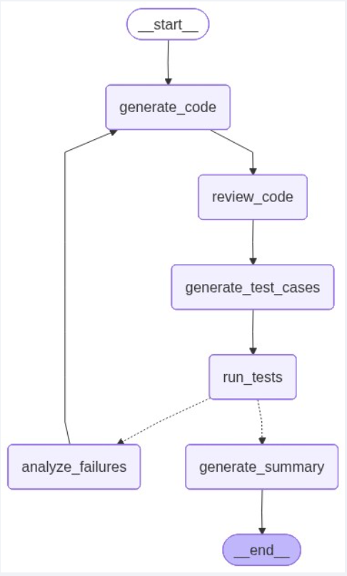
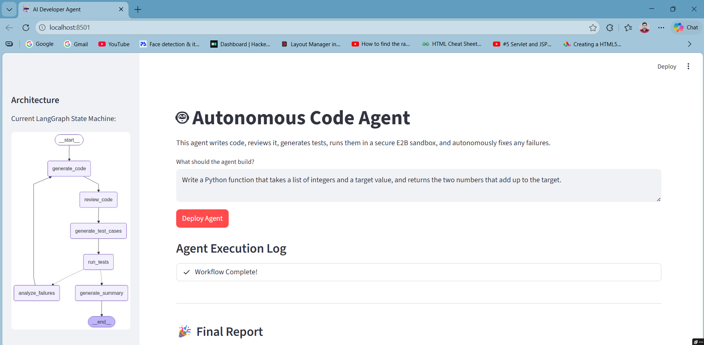
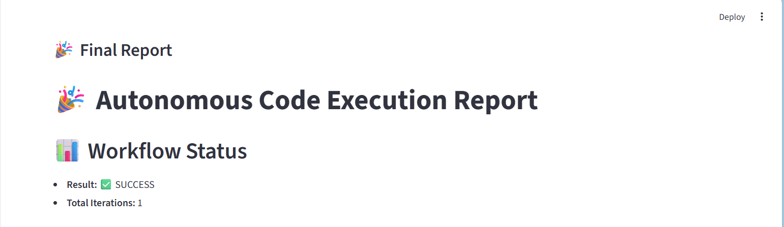
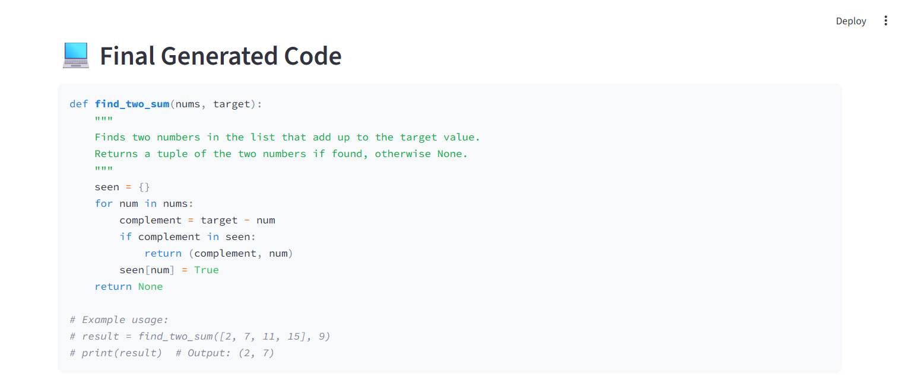
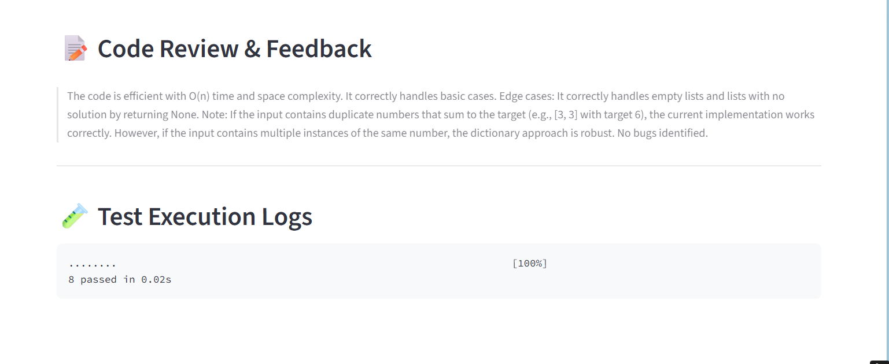

# 🤖 Autonomous Code Agent

An **agentic workflow** built with **LangGraph** and **Gemini 3.1 Flash Lite Preview** that automates the entire software development lifecycle. This system goes beyond simple code generation—it reviews, tests, executes, and **self-heals** its own code until it meets quality standards.

---

## 📌 Introduction

Modern software development requires constant iteration, testing, and debugging. The **Autonomous Code Agent** handles this entire loop automatically:

- Generates code from natural language requirements  
- Reviews and improves its own output  
- Writes and executes unit tests  
- Detects failures and fixes bugs autonomously  
- Produces a final validated report  


---

## ✨ Overview

This project automates the development loop with a focus on:

- 🧠 **Logic Synthesis**: Converts natural language into executable Python code  
- 🔁 **Self-Correction**: Uses test failure logs to iteratively fix bugs  
- 🔒 **Security First**: Executes all generated code inside an isolated cloud sandbox  

---

## 🧩 System Architecture

At its core, the system operates as a **state machine workflow**:

## 🔄 Workflow

<p align="center">
  
</p>

| Node | Responsibility |
|------|----------------|
| 1. Generate Code | Converts requirements into Python logic |
| 2. Review Code | Performs static analysis for quality and security |
| 3. Generate Tests | Creates pytest-based unit tests |
| 4. Run Tests | Executes code in an isolated E2B sandbox |
| 5. Analyze Failures | Identifies root causes and loops back |
| 6. Summary | Produces final validated report |

---

## 📸 Project Walkthrough

### 1. User Interface
- Built with **Streamlit**
- Provides real-time interaction and visibility into execution

<p align="center">
  
</p>

### 2. Live Execution
- Displays step-by-step logs of the agent’s reasoning and actions

### 3. Sandbox Testing
- Code runs in a **secure isolated environment**
- Prevents risk to local systems


### 4. Final Report
- Outputs production-ready code
- Includes full audit trail and execution logs

<p align="center">
  
</p>
<p align="center">
  
</p>
<p align="center">
  
</p>

---

## 🚀 Getting Started

### ✅ Prerequisites

- Python 3.10+
- Langchain
- LangGraph
- E2B API Key
- Google AI Studio API Key
- Streamlit

---

## ⚙️ Installation

```bash
# Clone the repository
git clone https://github.com/DeepakMishra99/Autonomous-CodeReview-Testing-Agent.git
cd Autonomous-CodeReview-Testing-Agent

# Install dependencies
pip install -r requirements.txt